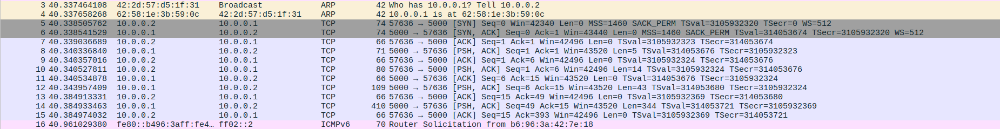
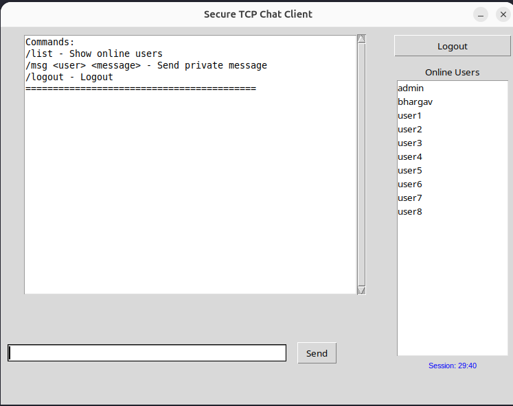
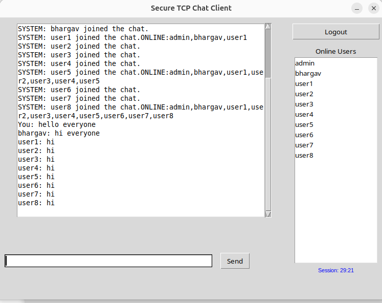
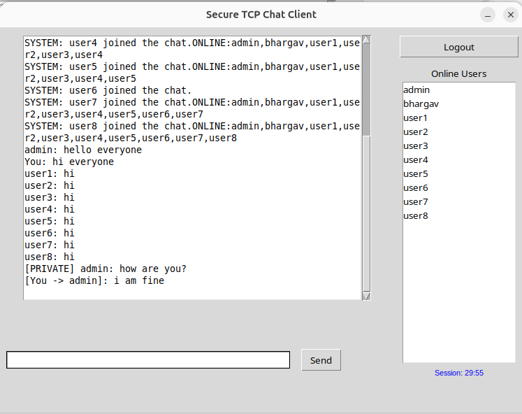
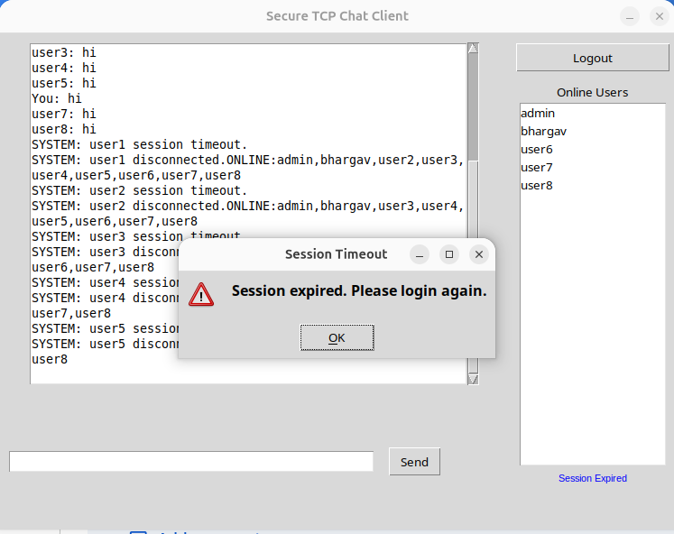
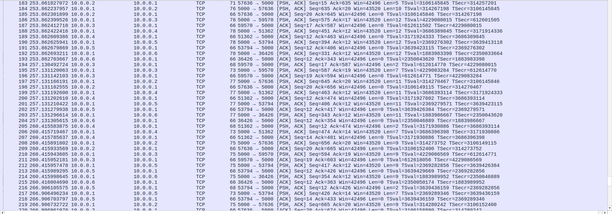
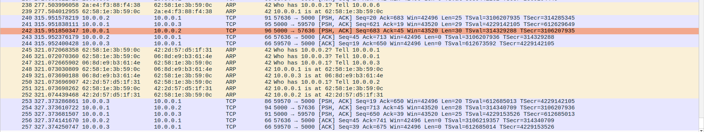
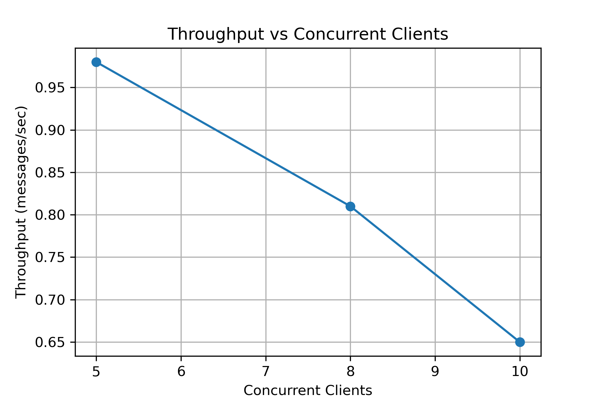

# ISEAPhase3-TezpurUniversity-Assignment8

**Application Optimization, Scalability and Reliability**
Networking Internship Program — Tezpur University
Submitted by: **Bhargav Jyoti Saikia** (Roll No. CSB24022)

## Overview

This assignment builds on the GUI-based multi-client TCP chat application from Assignment 7, focusing entirely on **optimization** rather than new features. The existing client-server implementation was enhanced for better connection management, reliability, scalability, and configuration management, and its performance was benchmarked before and after these changes using a Mininet `single,11` topology with 5, 8, and 10 concurrent clients.

The communication protocol, message formats, and core client/server structure from earlier assignments were left unchanged, as required.

## Key Optimizations

- **Connection Management** — automatic detection and cleanup of disconnected clients, resource release on disconnect, meaningful server-side log messages.
- **Reliability** — automatic client reconnection with retry/backoff, graceful shutdown on both client and server, idle-session timeout with a visible countdown, structured exception handling for socket errors.
- **Scalability** — thread-per-client server model with `threading.Lock`-protected shared state, single-pass broadcast with inline dead-client cleanup, verified stable at 10 concurrent clients.
- **Configuration Management** — all tunable values (`PORT`, `SESSION_TIMEOUT`, `MAX_LOGIN_ATTEMPTS`, `LOGIN_BLOCK_DURATION`, `MAX_MESSAGE_SIZE`, etc.) centralized in `config.json`, loaded identically by both client and server.
- **Performance Evaluation** — delay and throughput measured and logged to `performance_results.csv` at 5, 8, and 10 concurrent clients, visualized in `graphs/`.

## Repository Structure

```
ISEAPhase3-TezpurUniversity-Assignment8/
├── server.py                     # Optimized TCP chat server
├── client_gui.py                 # Optimized Tkinter GUI client
├── config.json                   # Centralized configuration
├── performance_results.csv       # Delay/throughput results (5, 8, 10 clients)
├── assignment8_capture.pcapng    # Wireshark capture (tcp.port == 5000)
├── report.pdf                    # Full assignment report
├── graphs/
│   ├── Average_Delay_vs_Concurrent_Clients.png
│   └── throughput_vs_clients.png
└── screenshots/
    ├── server_initialization.png
    ├── users_list.png
    ├── broadcast_messaging.png
    ├── private_messaging.png
    ├── session_timeout.png
    ├── user_disconnected.png
    ├── logout.png
    ├── wireshark_broadcast_msg.png
    └── wireshark_private_msg.png
```

## Setup and Usage

### Requirements
- Python 3
- Mininet
- Wireshark (for capture verification)

### Network Topology

```bash
sudo mn --topo single,11
```

### Running the Server

```bash
python3 server.py
```

The server reads all configuration from `config.json` and listens on the configured `HOST`/`PORT`.

### Running a Client

```bash
python3 client_gui.py
```

Enter the server IP, username, and password in the login window to connect.

## Screenshots

### Server Initialization


### Online Users List


### Broadcast Messaging


### Private Messaging


### Session Timeout Handling


### Client Disconnection (Server Log)


### Logout (Server Log)


### Wireshark — Broadcast Message Capture


### Wireshark — Private Message Capture


## Performance Graphs

### Average Delay vs Concurrent Clients


### Throughput vs Concurrent Clients


## Performance Summary

| Concurrent Clients | Broadcast Msgs | Private Msgs | Avg Delay (ms) | Throughput (msg/sec) |
|---|---|---|---|---|
| 5  | 20 | 1 | 812.4  | 0.98 |
| 8  | 32 | 2 | 1186.3 | 0.81 |
| 10 | 40 | 2 | 1537.6 | 0.65 |

As concurrent clients increase, average delay rises and throughput falls, indicating the sequential, lock-protected broadcast loop as the primary bottleneck at higher client counts — noted as the area to address for scaling beyond 10 users.

## Wireshark Verification

Traffic was captured on the switch interface using the filter `tcp.port == 5000`, confirming:
- Correct TCP three-way handshake for every new client connection.
- Broadcast messages fanned out identically to all connected clients.
- Private messages routed point-to-point to only the intended recipient.
- Clean FIN/ACK teardown on client disconnect.

## Report

See `report.pdf` for the full write-up, including scalability/reliability implementation details, graph analysis, Wireshark verification, and challenges faced.
