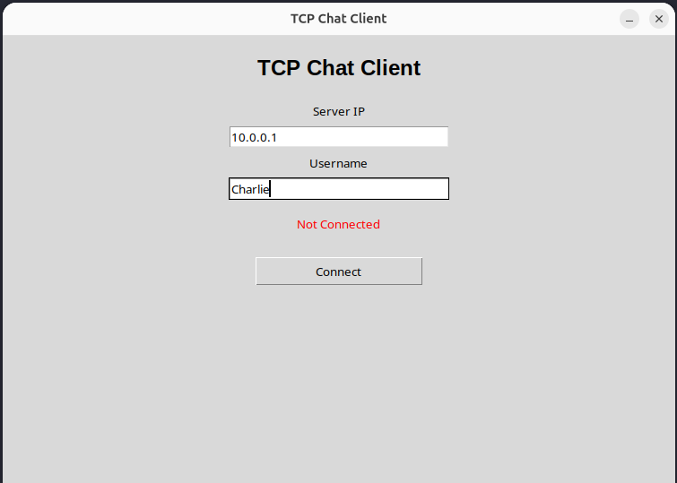
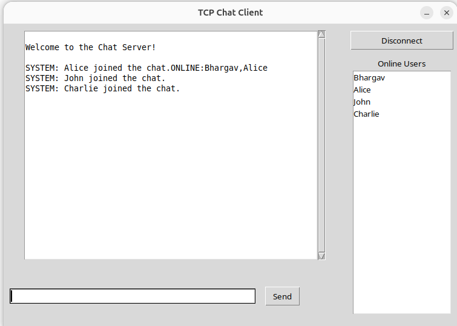
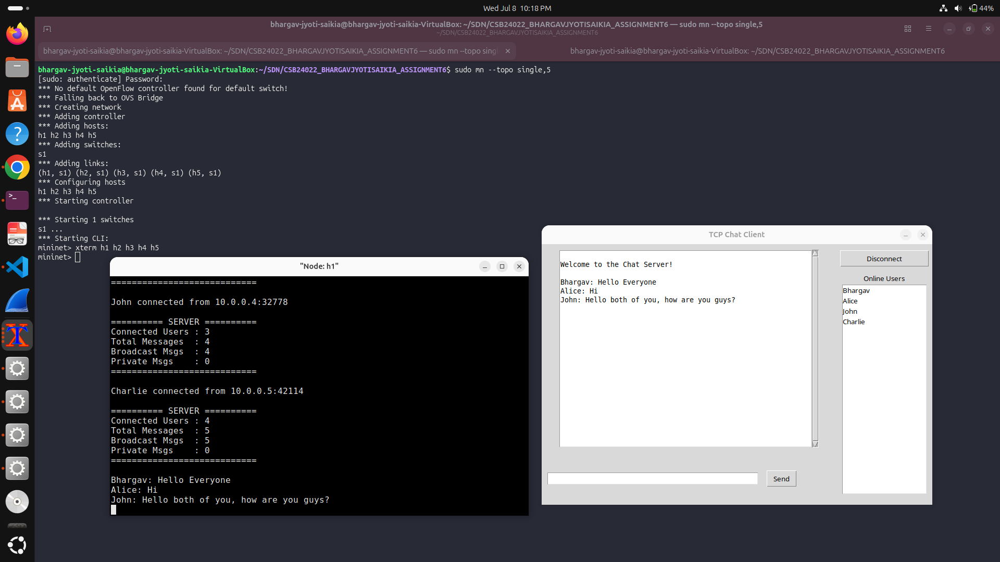
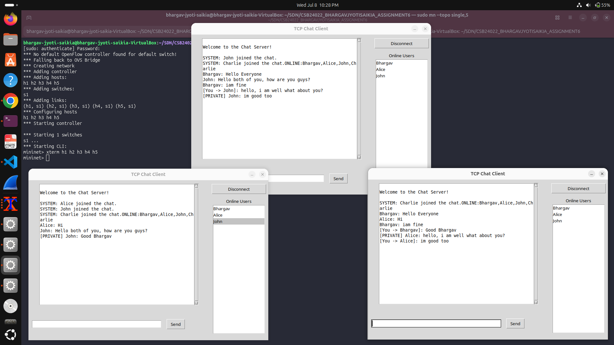
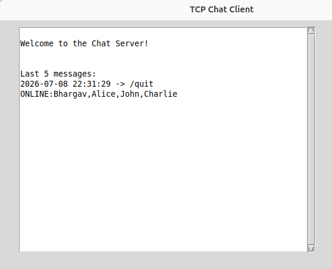
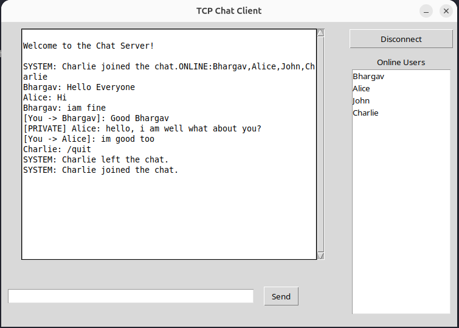
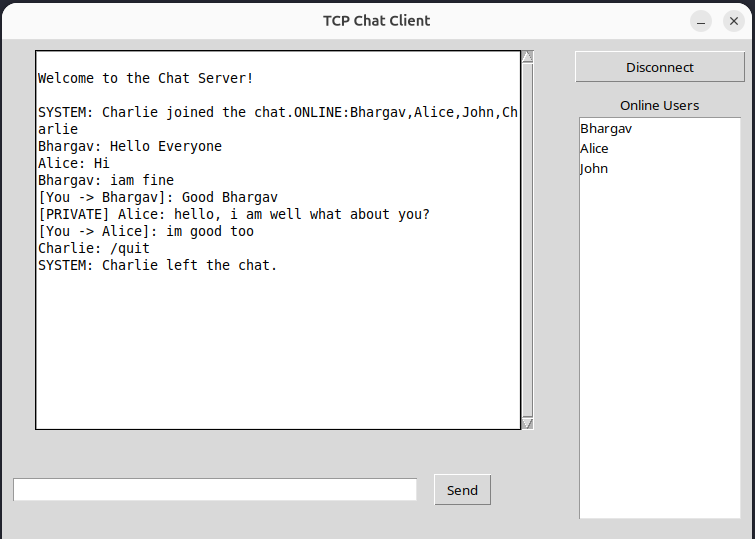
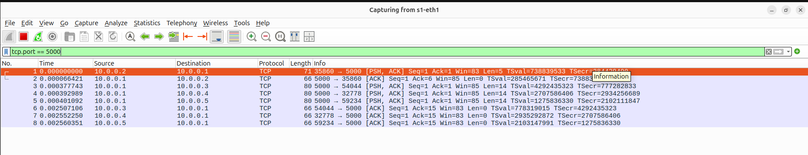
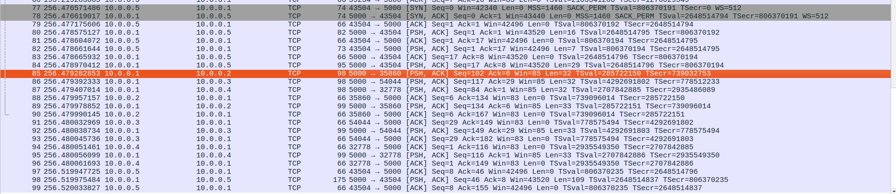
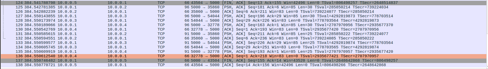

# Assignment 6 – GUI-Based Multi-Client Chat Application Using TCP

**Student:** Bhargav Jyoti Saikia
**Roll Number:** CSB24022
**Program:** Networking Internship, Phase 3 – Tezpur University

## Objective

Convert the terminal-based TCP chat application built in Assignment 5 into a graphical
desktop application using Python's Tkinter library, while reusing the existing TCP server
implementation without modifying its core networking logic. The application demonstrates
GUI programming, event-driven design, multithreading for a responsive interface, broadcast
and private messaging, live online-user tracking, and Wireshark-based verification of the
underlying TCP communication.

## Software Requirements

| Component | Purpose |
|---|---|
| Ubuntu Linux (VirtualBox) | Host OS for running the Mininet emulated network |
| Python 3 | Programming language for the server and client |
| Tkinter | Standard Python GUI toolkit used to build the client interface |
| Socket Programming (`socket` module) | TCP client/server communication |
| Mininet | Emulates the network topology (one server, four clients) |
| Wireshark | Captures and analyzes TCP traffic on port 5000 |
| Visual Studio Code | Code editor used for development |

## Network Topology

Tested using a Mininet single-switch topology with one server host and four client hosts:

```
sudo mn --topo single,5
```

| Host | Role |
|---|---|
| h1 | Chat Server (`server.py`, listens on `0.0.0.0:5000`) |
| h2 | Client A (`client_gui.py` – user "Bhargav") |
| h3 | Client B (`client_gui.py` – user "Alice") |
| h4 | Client C (`client_gui.py` – user "John") |
| h5 | Client D (`client_gui.py` – user "Charlie") |

All hosts connect through a single OVS switch (`s1`). Connectivity was verified inside the
Mininet CLI using `nodes`, `net`, and `pingall` before starting the server and clients.

## Execution Steps

1. **Start Mininet** with the required topology:
   ```
   sudo mn --topo single,5
   ```
2. **Open terminals** for the server and each client:
   ```
   mininet> xterm h1 h2 h3 h4 h5
   ```
3. **Start the server** on h1:
   ```
   python3 server.py
   ```
4. **Start each client** on h2–h5:
   ```
   python3 client_gui.py
   ```
5. In each client's login window, enter the **Server IP** (`10.0.0.1`) and a **Username**,
   then click **Connect**.
6. Use the message box and **Send** button (or Enter key) to broadcast messages to all
   connected users.
7. Send a private message using:
   ```
   /msg <username> <message>
   ```
8. Click **Disconnect** (or close the window) to leave the chat cleanly.
9. **Capture traffic** in Wireshark on the `s1-eth1` interface with the filter:
   ```
   tcp.port == 5000
   ```

## Sample Screenshots

**Login Window**


**Connection Established / Chat Window**


**Broadcast Messaging**


**Private Messaging**


**Online User List**


**User Joining**


**User Leaving**


**Wireshark – Connection Establishment**


**Wireshark – Broadcast Message Capture**


**Wireshark – Private Message Capture**


**Wireshark – Client Disconnection (FIN/ACK)**


## Implementation Overview

- **`server.py`** — Reused from Assignment 5 with no changes to its core logic. Accepts
  multiple TCP connections, spawns one handler thread per client, and maintains a shared
  `clients` dictionary protected by a `threading.Lock`. Supports broadcast messaging,
  private messaging (`/msg <username> <message>`), an online-user broadcast (`ONLINE:` prefixed
  list), and CSV-based chat history logging.
- **`client_gui.py`** — New GUI front end built with Tkinter. Presents a **login window**
  (Server IP + Username + Connect button) followed by a **chat window** containing a
  scrollable, read-only chat log (`ScrolledText`), a message entry box with Enter-to-send,
  a **Send** button, a **Disconnect** button, and a live **Online Users** `Listbox`.
- **Background threading** — A dedicated daemon thread runs `receive()`, continuously
  calling `client.recv()` and updating the GUI (chat log or online-user list) as messages
  arrive, so the blocking socket call never freezes the Tkinter main loop.
- **Protocol reuse** — The GUI client speaks the exact same wire protocol as the
  Assignment 5 terminal client (plain-text messages, `/msg`, `/quit`, and `ONLINE:` status
  updates), so the server required no changes.
- **Verification** — Functionality was tested with four simultaneous GUI clients inside
  Mininet, and Wireshark captures on `tcp.port == 5000` confirmed correct TCP handshake,
  message delivery, and connection teardown (FIN/ACK) at the packet level.
